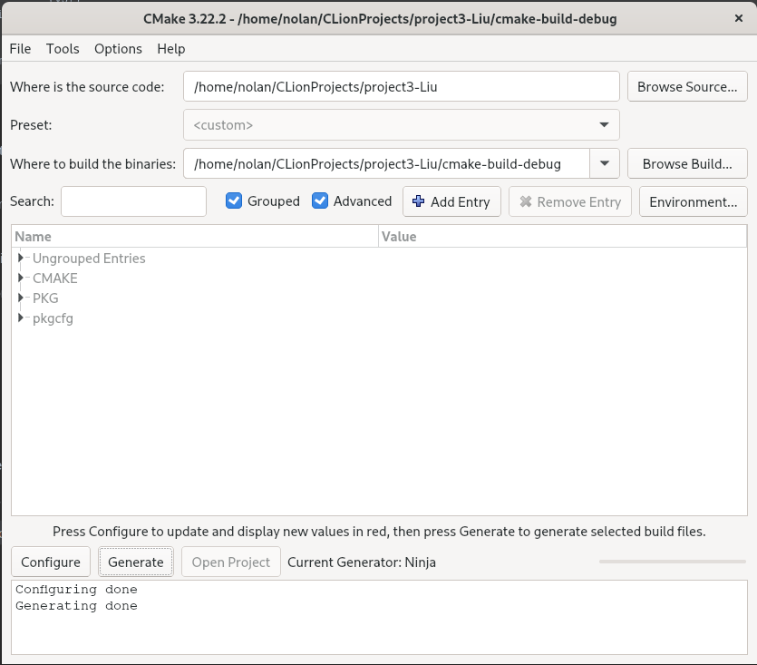

# Knowledge Based Intelligence System
######Project 3 by: Francisco, Nolan, Daniel

##Build Instructions:
****
###Dependencies (Linux Fedora):

    - cmake           (v3.21+)
    - cmake-gui       (any)
    - gtkmm30         (v30+)
    - gtkmm30-devel   (v30+)
    - gtk3.0          (v3+)  
    - ninja-build     (v1.10+)
    - clang           (v14.0.0+)
    
    Package Names were taken from the deafault Fedora 35 Repositories.


###Build
####(Build Instructions are not available on MacOS, or Windows)

1. Clone this Project
2. Launch cmake-gui and create the Ninja-Build config file
   1. 
   2. Enable the option: CMAKE >> CMAKE_EXPORT_COMPILE_COMMANDS
   3. Click ```Configure```, Then ```Generate```
   4. If you see that the Configure, and Generate Commands have completed successfully, Close this window and proceed to step 3.
3. Run the Command "```$ProjectRoot~ cmake build .```"
4. Launch the ```./compile.sh``` to build and automatically run the program.


